  
  
   
  

  

 

  
  

 

  

> [!NOTE] 
> **Action Required**: To show the detailed Simon Lecoq style metrics below, you need to add a `METRICS_TOKEN` secret to your repository settings (Settings -> Secrets -> Actions).

